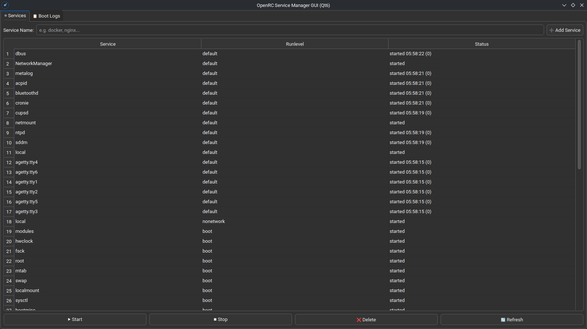
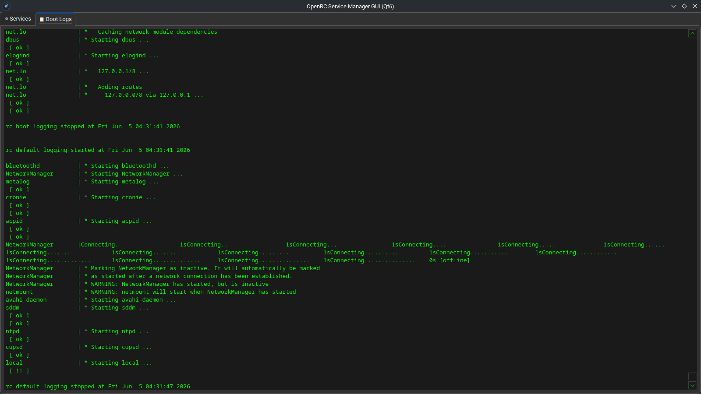

# OpenRC Manager GUI

A modern graphical user interface (GUI) built with **C++** and **Qt6** to easily manage OpenRC init services and monitor boot logs in real-time on Artix Linux, Arch Linux, or any OpenRC-based distribution.




## Features

- **Service Management**: Easily view, start, stop, refresh, and delete system services.
- **Boot Runlevels**: Explicit columns detailing which services are assigned to specific runlevels (e.g., boot, default, sysinit).
- **Real-Time Logs**: A built-in tab that streams `/var/log/rc.log` in real-time to monitor service initialization events.
- **Safety Disclaimer**: A built-in security warning to prevent accidental modifications to critical system services.

## Prerequisites & Dependencies

To compile and run this application, the following system components are required:

- **Qt6** (Core & Widgets modules)
- **CMake** (Build system)
- **kde-cli-tools** (Required for elevated graph privileges via `kdesu`)
- **pkgconf** & **base-devel** (For compilation support)

## Local Compilation & Testing

If you want to manually test the binary without installing it via a package manager:

```bash
cmake -B build -S .
cmake --build build
sudo ./build/openrc-manager-gui
```

## AUR Installation (Arch/Artix Linux)

This package is officially available on the Arch User Repository (AUR). You can easily install it using your preferred AUR helper (such as `yay` or `paru`):

```bash
yay -S openrc-manager-gui
```

## Security Notice

Modifying, stopping, or deleting critical system services can prevent your operating system from booting next time. Please use this application with extreme care and responsibility.
